# Práctica 6: Consumo de APIs y Manipulación del DOM

Esta práctica consiste en el desarrollo de una aplicación web que interactúa con la API pública **JSONPlaceholder**. El objetivo principal es gestionar publicaciones (posts) mediante operaciones CRUD, aplicando técnicas de programación asíncrona y manipulación segura del DOM.

## Funcionalidades Implementadas
* **Consumo de API:** Peticiones asíncronas mediante `fetch` con soporte para `async/await`.
* **Operaciones CRUD:**
    * **GET:** Carga inicial de 20 posts.
    * **POST:** Creación de nuevos registros con feedback visual.
    * **PUT:** Actualización de datos existentes.
    * **DELETE:** Eliminación de registros con confirmación.
* **Búsqueda Dinámica:** Filtro de contenido en tiempo real por título o cuerpo.
* **Seguridad:** Generación de interfaces mediante `createElement` y `textContent` para mitigar ataques XSS.

## Tecnologías y Estándares
* **JavaScript Vanilla:** Sin librerías externas ni frameworks.
* **Fetch API:** Manejo de promesas y validación de `response.ok`.
* **CSS:** Diseño responsivo, estados hover y spinner de carga.

---

## Evidencias de la Práctica

### 1. Lista Cargada (GET)
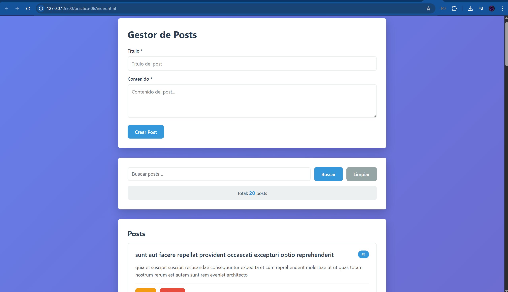
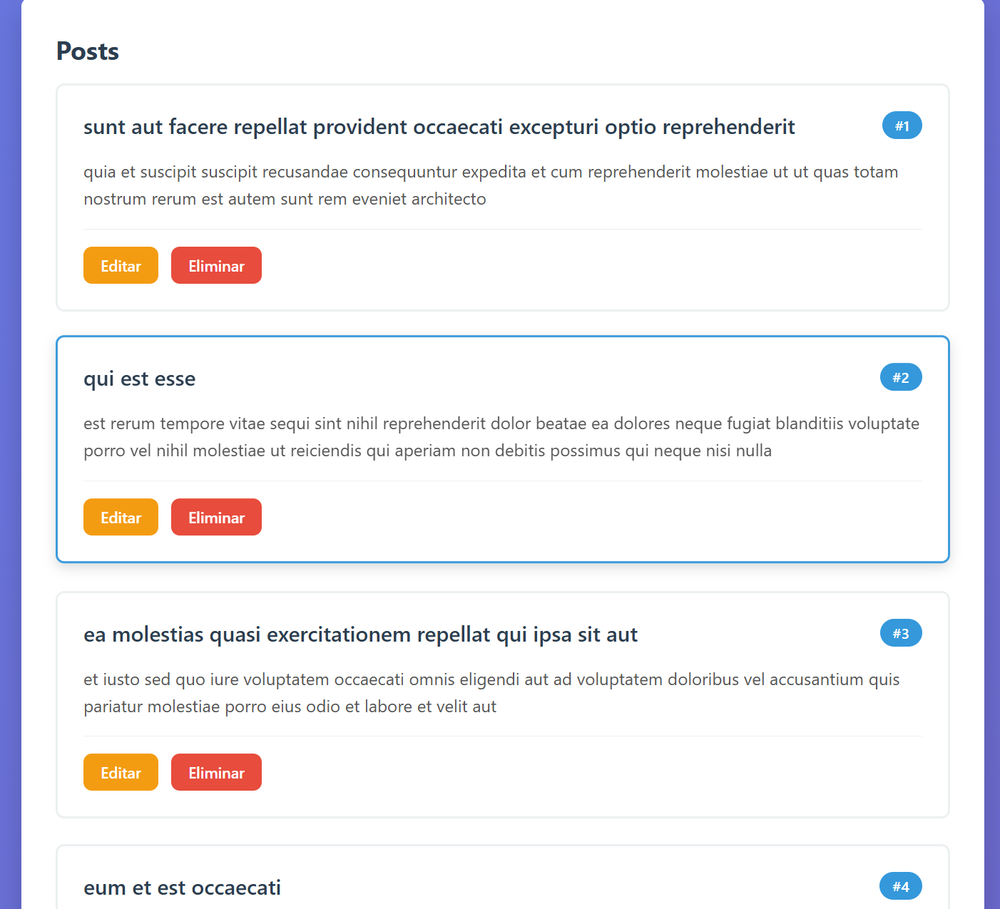
**Descripción:** Se observa el renderizado inicial de los 20 posts obtenidos desde la API. Cada tarjeta se genera dinámicamente como un objeto `HTMLElement`.

### 2. Estado de Carga (Spinner)
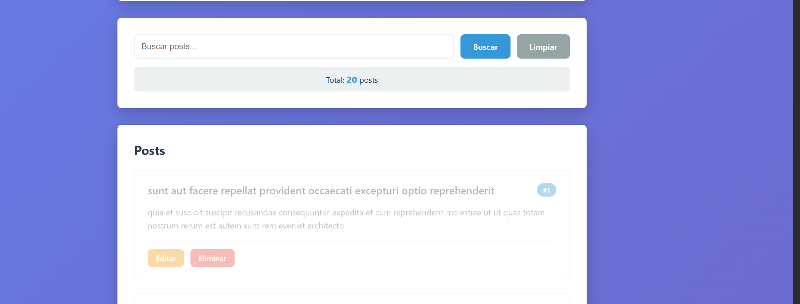
**Descripción:** Implementación de un feedback visual (spinner) que se muestra mientras la promesa de `fetch` está pendiente.

### 3. Crear Post (POST)
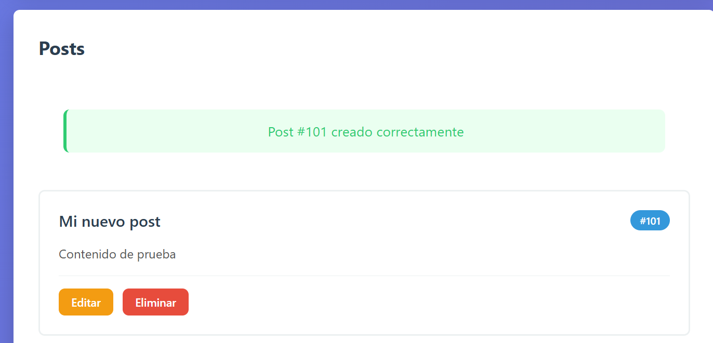
**Descripción:** Al enviar el formulario, se dispara una petición POST. Se observa el mensaje de éxito "Post #101 creado" y la inserción del elemento al inicio de la lista.

### 4. Editar y Actualizar (PUT)
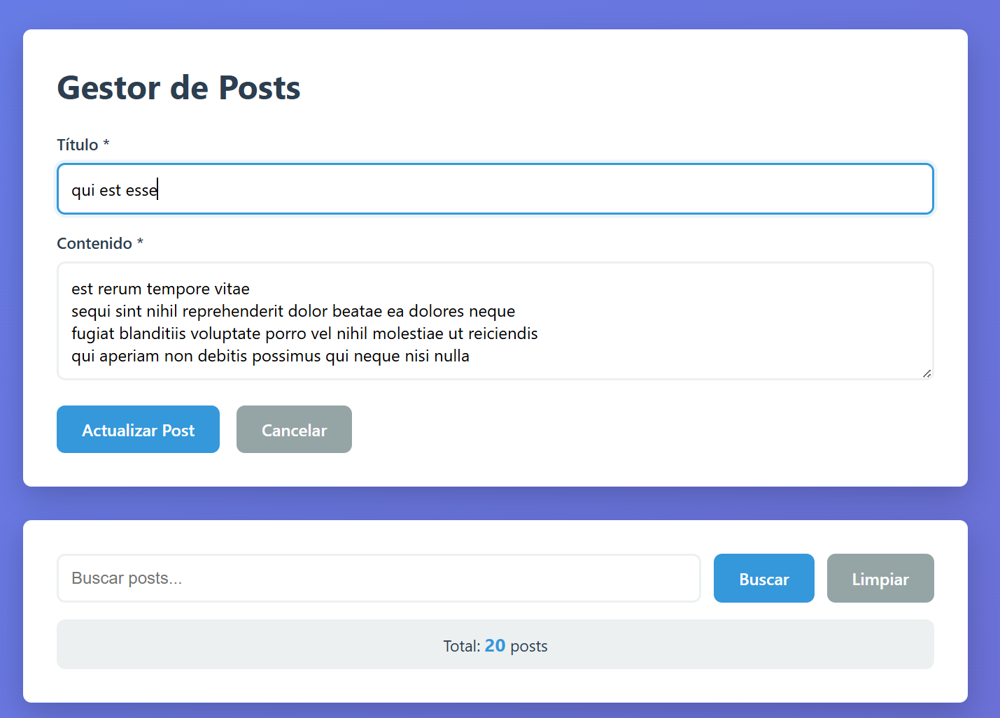
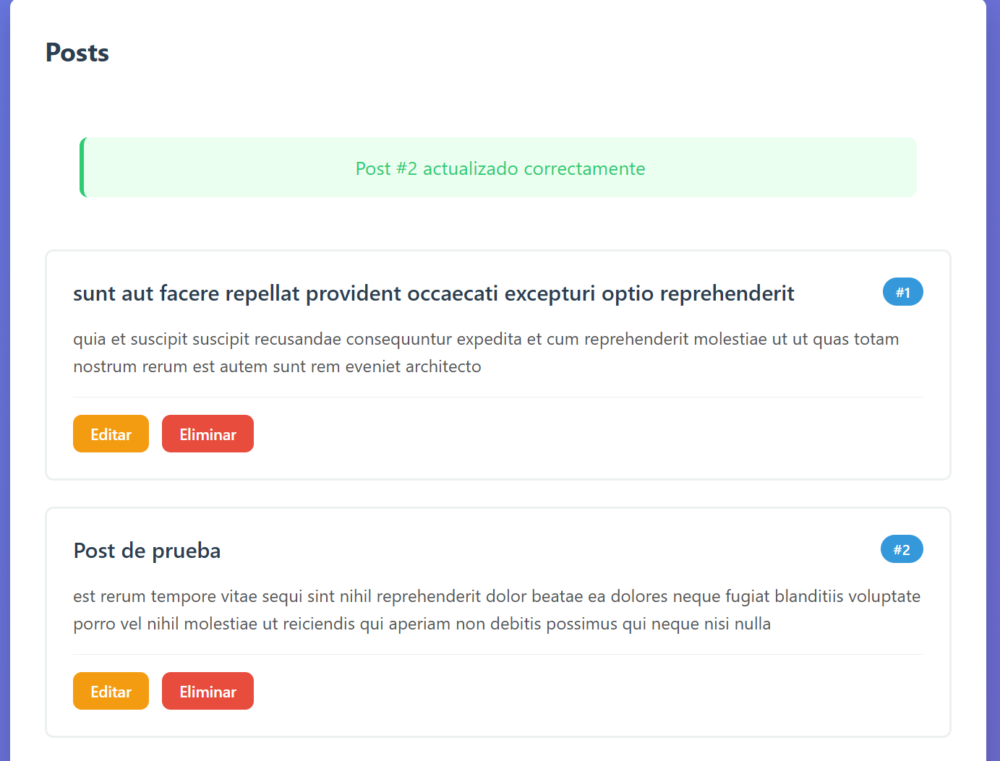
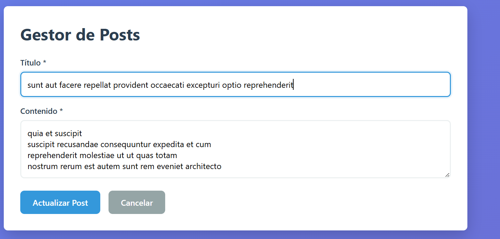
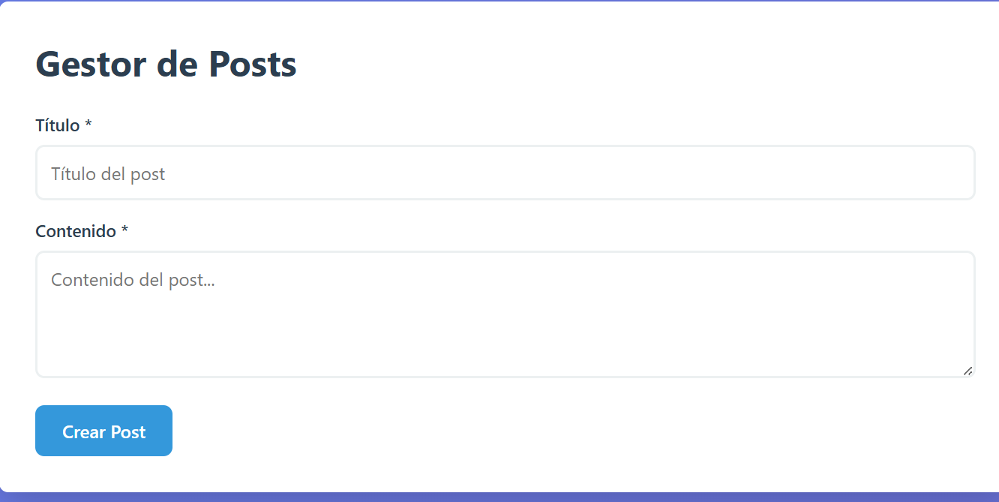
**Descripción:** Proceso de edición: el formulario se precarga con los datos del item y se realiza la actualización visual tras la respuesta exitosa de la API.

### 5. Eliminar Registro (DELETE)
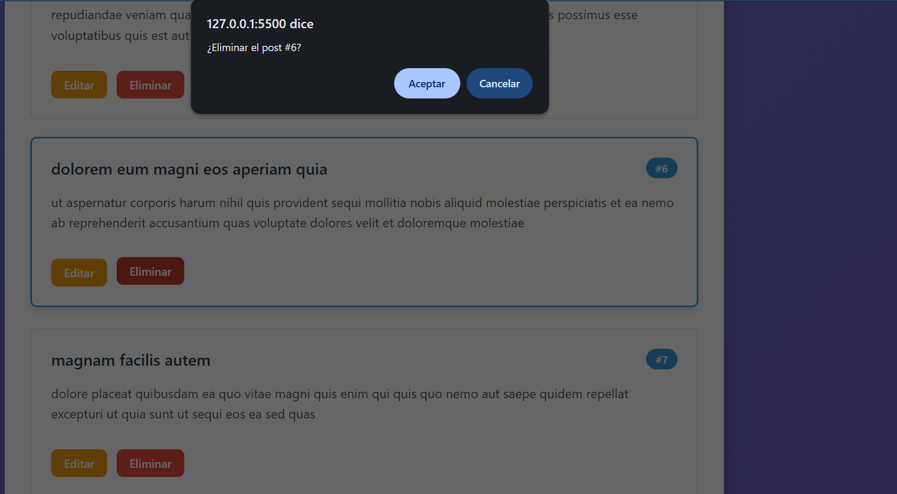
**Descripción:** Uso de `confirm()` antes de proceder con el DELETE. Al confirmar, el elemento se remueve del DOM y el contador se actualiza.

### 6. Inspección en DevTools (Network)
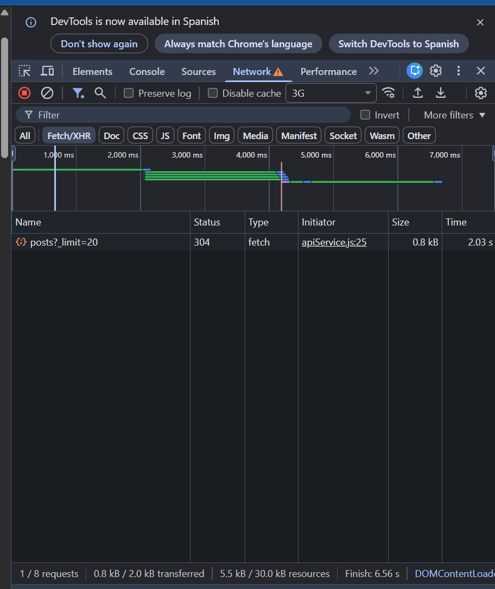
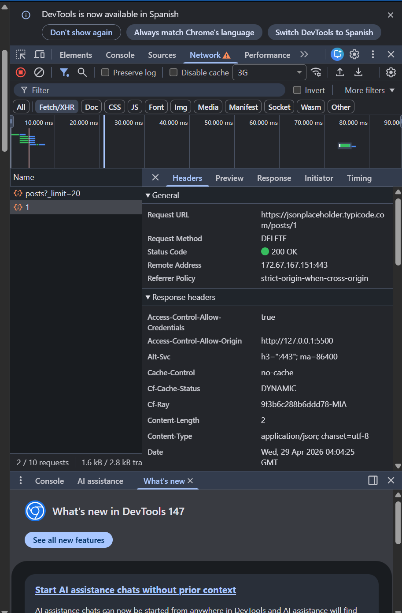
**Descripción:** Evidencia de las peticiones HTTP en la pestaña *Network*. Se validan los códigos de estado (200 OK, 201 Created) y los Payloads JSON enviados.

### 7. Manejo de Errores
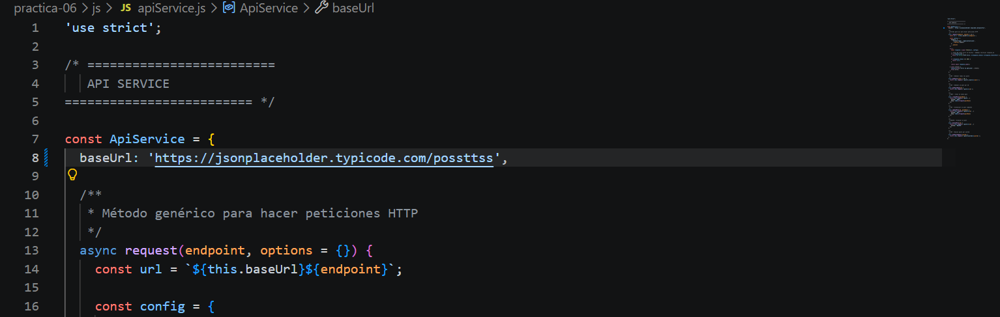
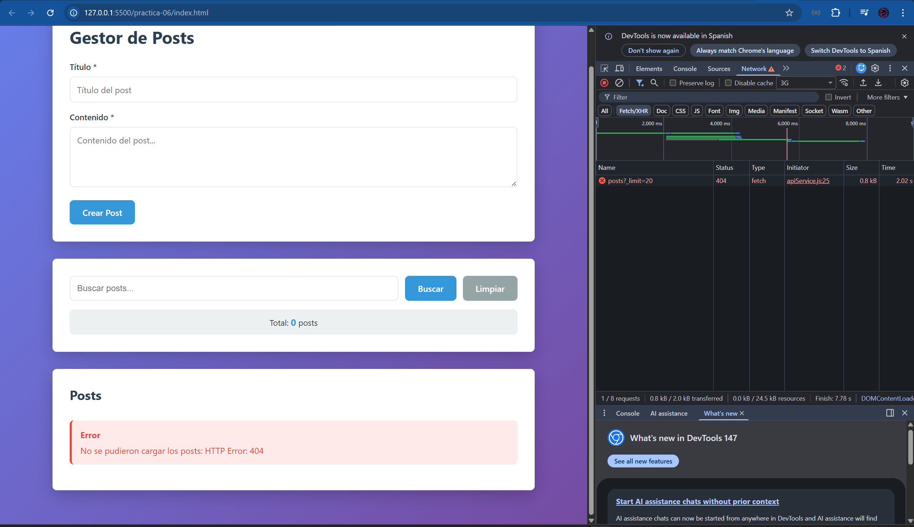
**Descripción:** Validación de errores de red. Si la URL es inválida o la API falla, se muestra un mensaje descriptivo en la interfaz en lugar de fallar silenciosamente.

---

## 📂 Estructura de la Carpeta
/06-dom
├── index.html
├── css/
│    └── styles.css
├── js/
│    ├── api.js         <-- Servicio centralizado de Fetch
│    └── app.js         <-- Lógica del DOM y Eventos
└── images/             <-- Capturas de pantalla

---
**Autor:** Josué Valdez  
**Docente:** Ing. Pablo Torres  
**Institución:** Universidad Politécnica Salesiana