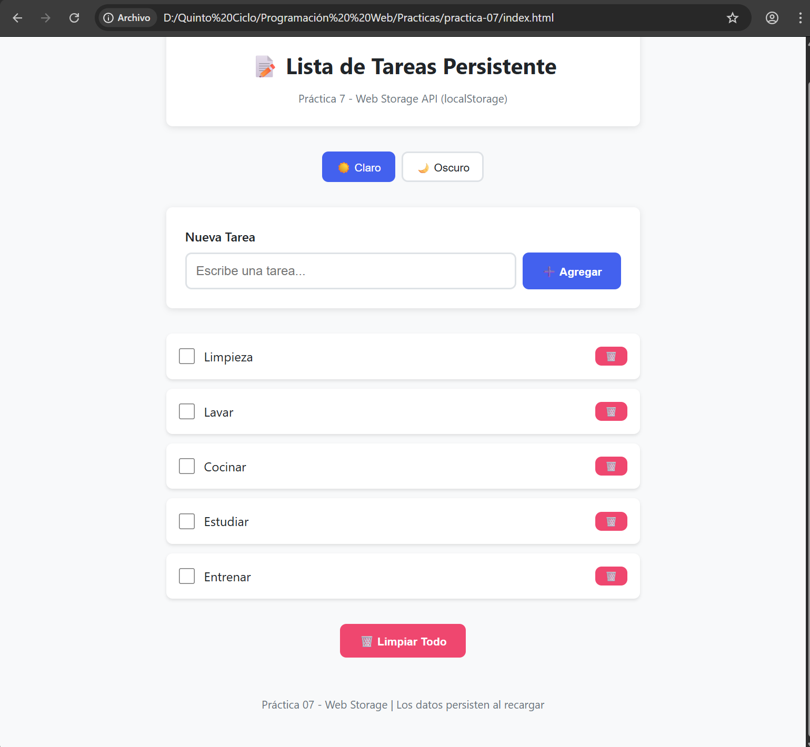
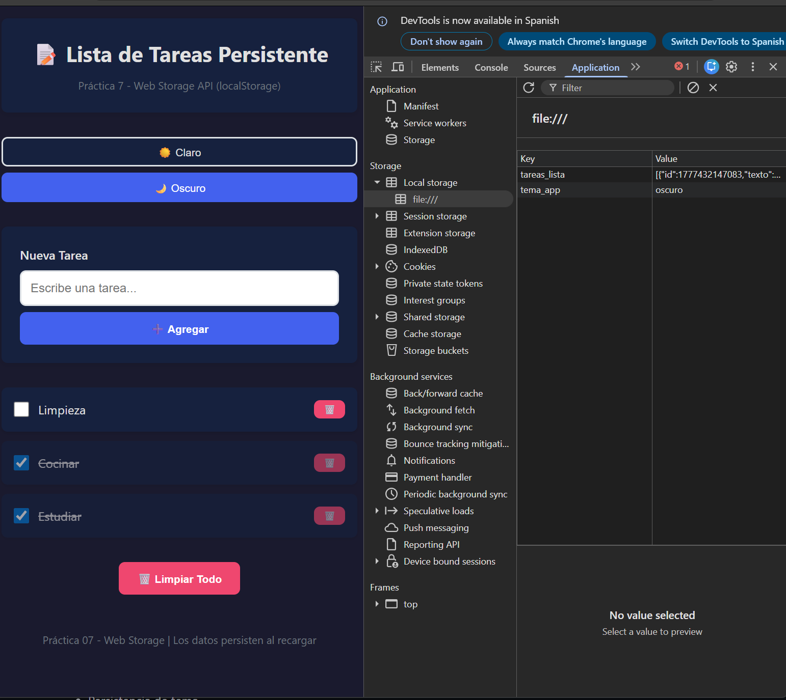
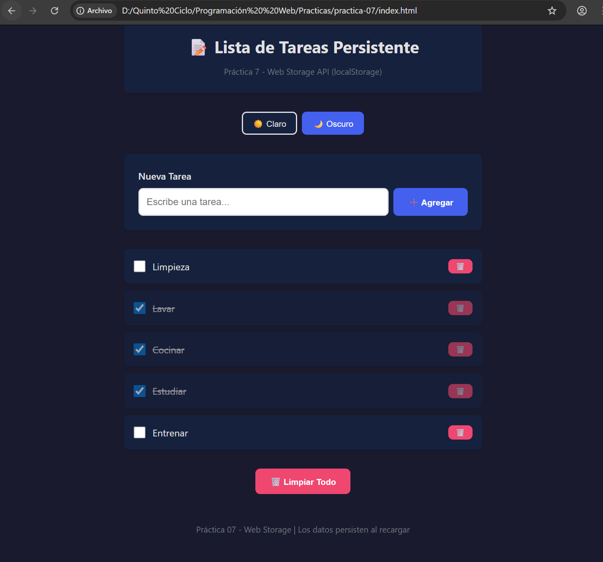
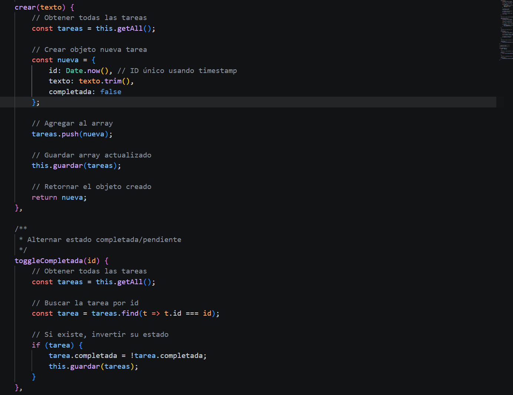

# Práctica 7: Web Storage y Persistencia

Este proyecto implementa una lista de tareas persistente utilizando **JavaScript Vanilla** y la API de **Web Storage** (`localStorage`). La aplicación permite gestionar tareas diarias y personalizar la apariencia mediante temas, asegurando que los datos no se pierdan al recargar la página.

##  Funcionalidades Principal
* **Persistencia Total:** Los datos se guardan en el navegador en formato JSON.
* **Arquitectura Limpia:** Uso de un patrón de servicio para separar la lógica de almacenamiento (`storage.js`) de la lógica de interfaz (`app.js`).
* **Seguridad:** Construcción dinámica del DOM mediante `createElement` para prevenir ataques XSS.
* **Temas Personalizados:** Selector de modo claro y oscuro con persistencia de preferencia.

##  Tecnologías Utilizadas
* HTML5 (Estructura semántica)
* CSS3 (Variables CSS para temas dinámicos)
* JavaScript ES6+ (Web Storage API, Manipulación del DOM)

---

## 📸 Evidencias de la Práctica

**Descripción:** Captura de la aplicación funcionando con tareas agregadas. Se valida que la interfaz muestra correctamente los datos recuperados del `localStorage`.

### 2. Inspección de Local Storage (DevTools)

**Descripción:** Evidencia de la pestaña *Application* donde se observa el almacenamiento de la clave `tareas_lista` con su respectivo valor en formato JSON.

### 3. Cambio y Persistencia de Tema

**Descripción:** Demostración del cambio a modo oscuro y cómo la preferencia se guarda en la clave `tema_app`, persistiendo tras recargar la página.

### 4. Implementación del Código (storage.js / app.js)

**Descripción:** Fragmento del código fuente donde se evidencia la lógica de serialización con `JSON.stringify` y la creación segura de elementos con `createElement`.