# Práctica 8: Validación Avanzada de Formularios y Componentes DOM

Esta práctica final integra todos los conocimientos adquiridos sobre manipulación del DOM, expresiones regulares (Regex) y eventos de usuario. Se ha desarrollado un sistema de registro robusto que valida datos en tiempo real y procesa la información de forma segura.

##  Funcionalidades Destacadas
* **Validación en Tiempo Real:** Uso de eventos `focusout` e `input` para proporcionar feedback inmediato (bordes de color y mensajes de error).
* **Seguridad (Anti-XSS):** Construcción de toda la interfaz de resultados mediante la API del DOM (`createElement`, `textContent`), evitando el uso de `innerHTML` con datos sensibles.
* **UX Avanzada:** * Botón de envío deshabilitado hasta cumplir requisitos mínimos.
    * Máscara dinámica para teléfonos: `(099) 999-9999`.
    * Indicador de fortaleza de contraseña con 5 niveles de seguridad.
    * Scroll automático hacia el primer error detectado.
* **Procesamiento de Datos:** Uso de `FormData` y `Object.fromEntries` para la recopilación eficiente de información.

##  Tecnologías Utilizadas
* **HTML5:** Formulario con atributo `novalidate`.
* **CSS3:** Estados de validación (`.campo--error`, `.campo--valido`) y animaciones.
* **JavaScript ES6+:** Regex avanzadas, delegación de eventos y arquitectura de servicios.

---

##  Evidencias de la Práctica

### 1. Estado Inicial y UX
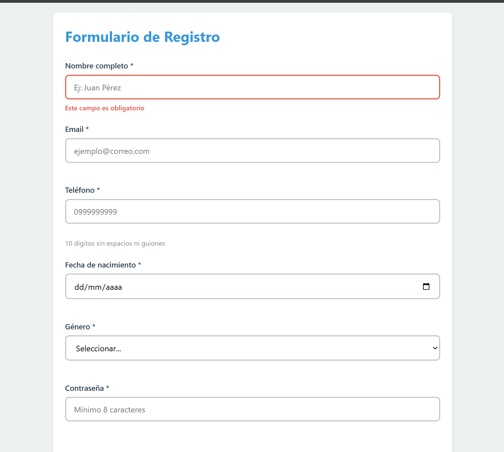
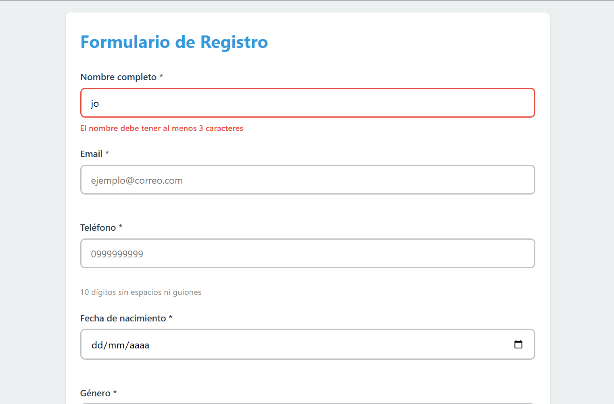
**Escribir** "Jo" → Mensaje "El nombre debe tener al menos 3 caracteres"
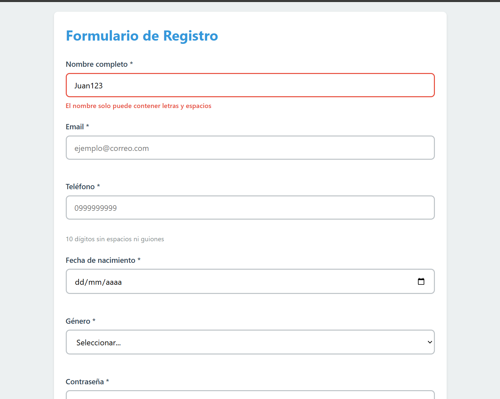
**Escribir** "Juan123" → Mensaje "El nombre solo puede contener letras y espacios"
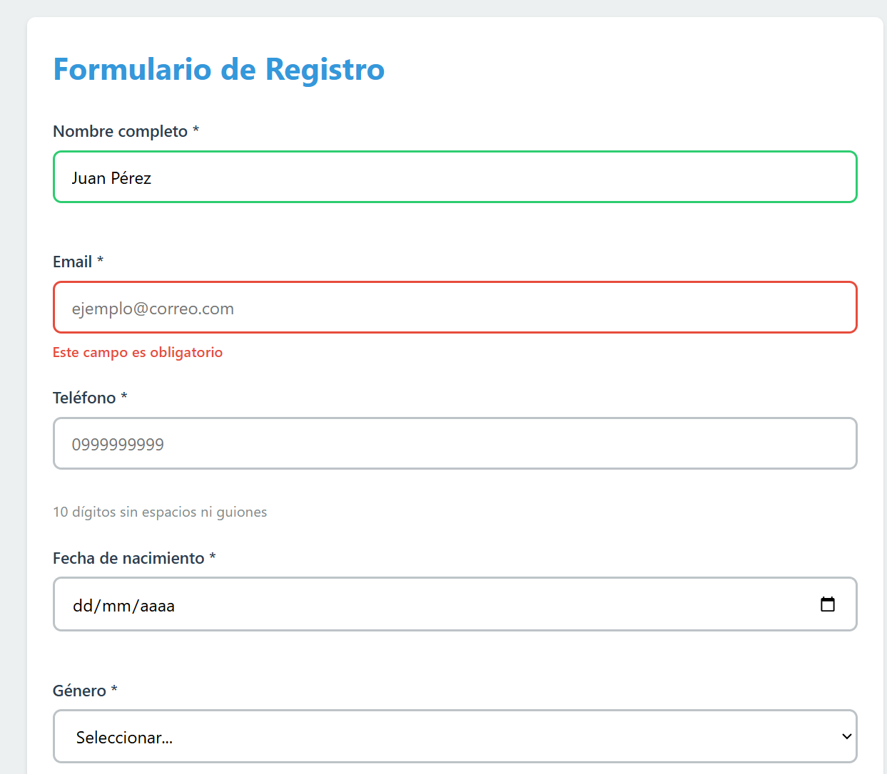
**Escribir** "Juan Pérez" → Borde verde, sin mensaje de error

**Descripción:** Vista inicial del formulario. Se observa el botón "Registrarse" deshabilitado y el foco automático en el campo Nombre para mejorar la accesibilidad.

### 2. Validación de Errores Críticos
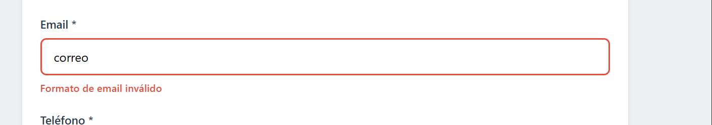

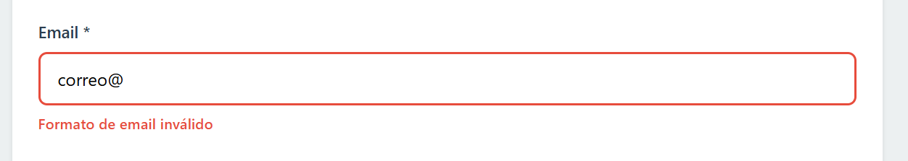

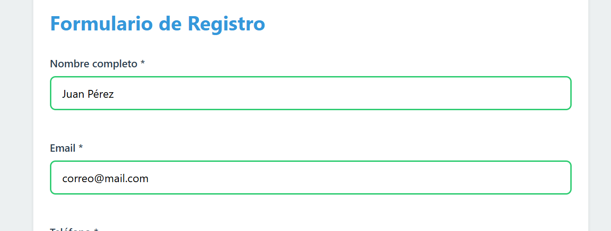

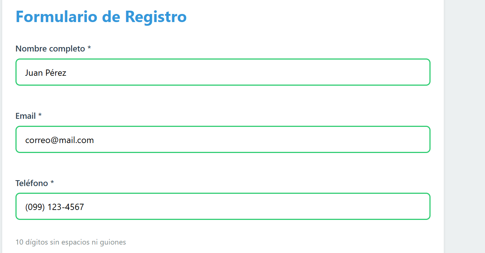

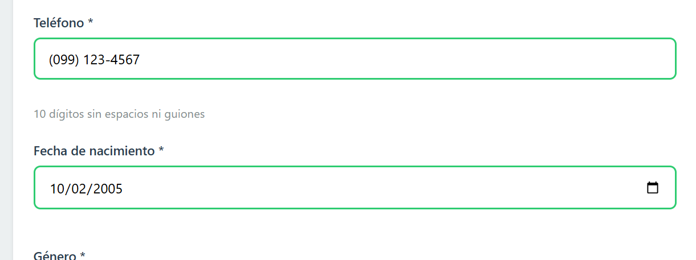

**Descripción:** Feedback visual ante datos erróneos. Se muestran mensajes específicos para: nombre corto, formato de email inválido, minoría de edad y contraseñas que no coinciden.

### 3. Fortaleza de Contraseña
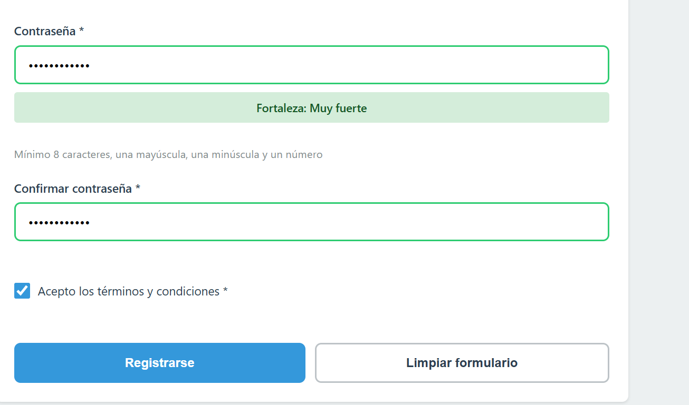

Esto sucede gracias al evento input que agregamos en app.js. Cada vez que presionas una tecla, se dispara la función evaluarFuerzaPassword del ValidacionService

**Descripción:** Demostración del algoritmo de evaluación de seguridad. El indicador cambia de color y texto (Muy débil -> Fuerte) según el uso de mayúsculas, números y longitud.

### 4. Máscara de Teléfono y Formateo

**Descripción:** Aplicación de máscara automática mientras el usuario escribe, limitando la entrada a 10 dígitos y aplicando el formato telefónico estándar.

### 5. Envío Exitoso y Resultado Seguro
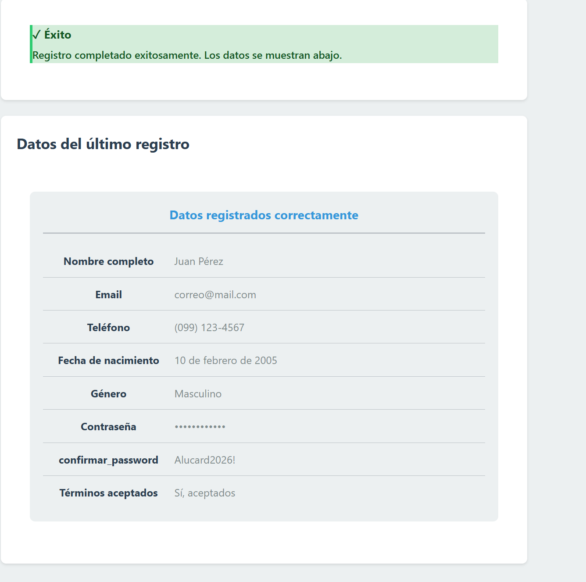
**Descripción:** Tras la validación exitosa, se genera una `ResultadoCard`. Se observa el formateo de fecha largo, la traducción de géneros y el enmascaramiento de la contraseña.

### 6. Inspección Técnica (DevTools Console)
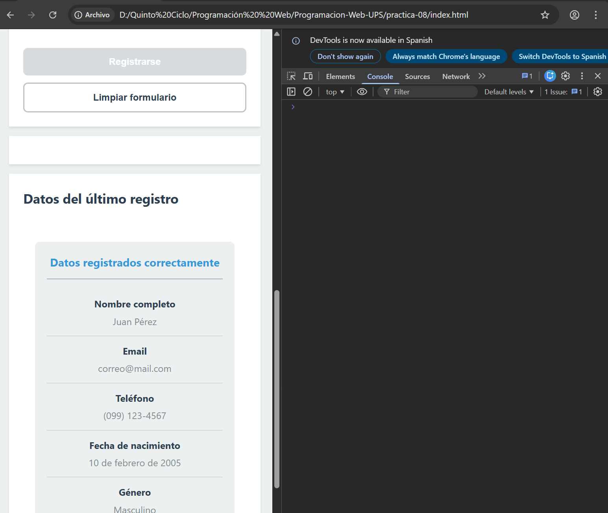

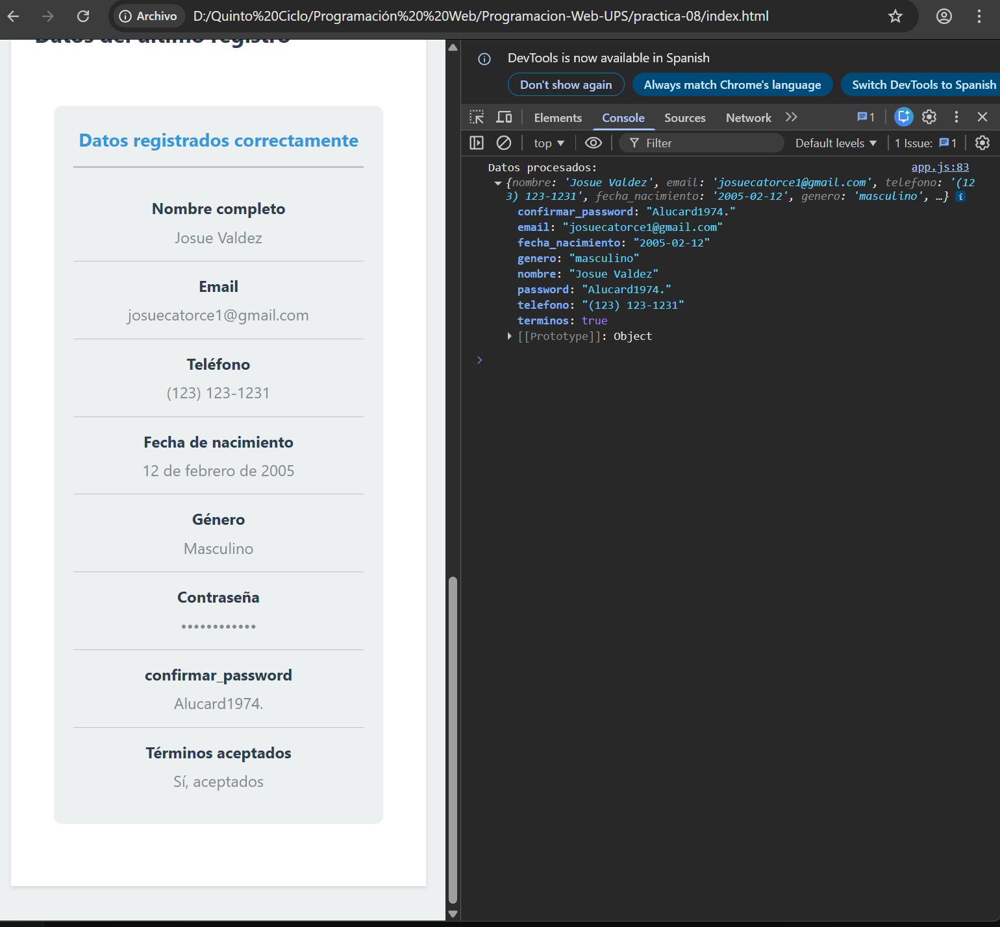

**Descripción:** Verificación en consola del objeto final generado mediante `FormData`, listo para ser enviado a un servicio backend.

---

##  Estructura de la Carpeta
/08-final
├── index.html
├── css/
│    └── styles.css
├── js/
│    ├── validacion.js  <-- Lógica de Regex y Reglas
│    ├── components.js  <-- Generación de elementos DOM
│    └── app.js         <-- Orquestador de Eventos
└── images/             <-- Capturas de evidencia

---
**Estudiante:** Josué Valdez (Alucard)  
**Carrera:** Computación - Quinto Ciclo  
**Docente:** Ing. Pablo Torres  
**Institución:** Universidad Politécnica Salesiana